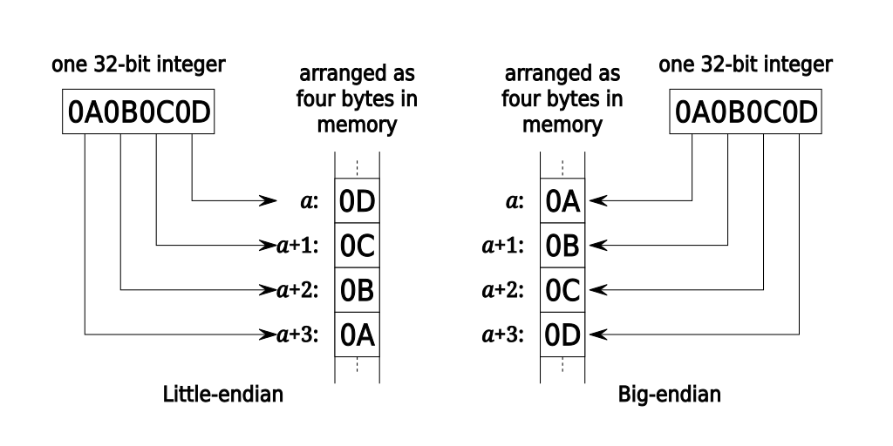

Endianness é a ordem em que os bytes ficam na memória.

- **Little-endian** - Do menor pro maior. Se temos `0x0A0B0C0D`, fica `0D 0C 0B 0A` na memória. Muito mais comum.

- **Big-endian** - A ordem padrão. `0x0A0B0C0D` fica `0A 0B 0C 0D` na memória. Menos comum.

    

Use `file arquivo` para ver se está em Little-endian ou Big-endian.