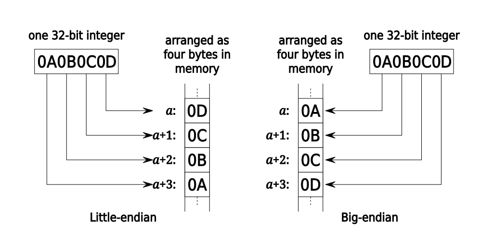

Endianness é a ordem em que os bytes são transmitidos em uma comunicação de dados ou a ordem em que estão inseridos na memória do computador. 

- **Little-endian** - O menor número vem primeiro, e o maior vai por último. Se temos `0x0A0B0C0D`, na memória esse número estará como: `0D 0C 0B 0A`. A maioria massiva dos computadores utiliza Little-endian.

- **Big-endian** - A ordem padrão. `0x0A0B0C0D` fica `0A 0B 0C 0D` na memória. Poucos computadores e protocolos utilizam essa ordem.

Quando for fazer inserções na memória via inputs no programa (como veremos mais para frente), verifique primeiro o arquivo com `file arquivo` e veja se está em Little-endian ou Big-endian. Dependendo de como estiver, você terá que mudar a ordem dos bytes inseridos.
