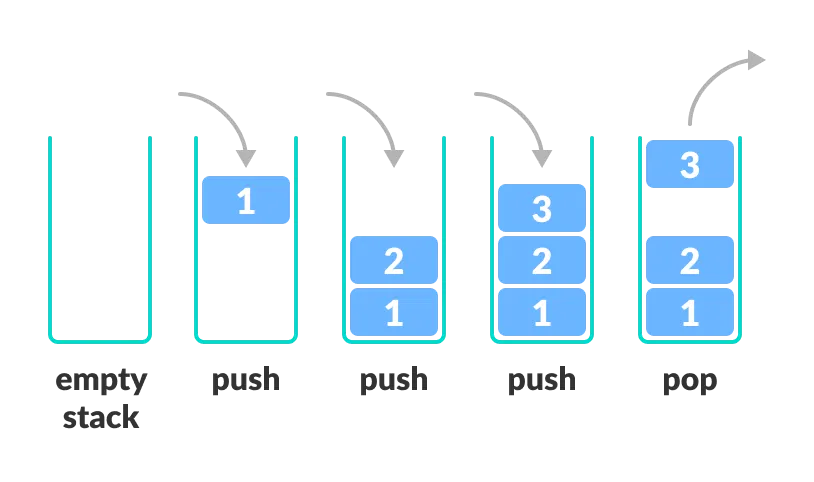
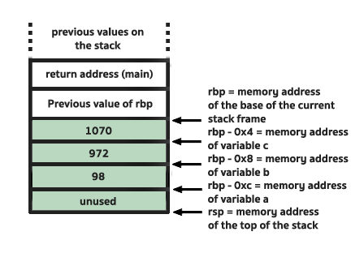

## Conceito de Stack

A stack é um conceito simples de Estrutura de Dados. Consiste apenas em uma ideia de como organizar informação. Imagine que você possui um tubo onde você pode colocar bolinhas, somente pelo topo. Se você enxer o tubo, para retirar bolinhas, você precisará começar a remover pelas bolinhas mais recentes que você colocou.

A Stack é basicamente isso. Começamos a resolver, ou **desempilhar** as coisas começando das mais recentes para as mais antigas. Na Stack, **o último será o primeiro**.

A stack é uma estrutura de dados com duas operações: push e pop.

- `push` - Coloca novo valor no topo da stack
- `pop` - Remove valor do topo da stack e extrai seu valor

<div style={{textAlign: 'center'}}>
    
</div>

Imagine agora que temos uma função que chama outra função, e esta função chama outra função. Quando a última função retorna, devemos começar a resolver as coisas pela primeira função? Não. Vamos resolvendo pela ordem inversa, até que a segunda retorne na primeira, e a primeira conclua sua execução (é como abrir uma matriosca (Boneca russa), cada chamada abre uma matriosca menor. Para colocarmos tudo de volta, temos que começar da última matriosca retirada até a primeira).

```C
int function1(int n){
    return function2(n) + 1;
}
int function2(int n){
    return function3(n) + 1;
}
int function3(int n){
    return n + 1;
}

int main(){
    int result = function1(10);

    return 0;
}
```

Dessa forma, o conceito de Stack é utilizado na arquitetura de programas para **organizar o fluxo do programa e o escopo de funções**.

## Stack para Assembly

Para Assembly e o processador, a stack é uma **região contínua de memória no computador onde as variáveis locais serão armazenadas**. Ela é uma estrutura de dados com duas operações: **PUSH** (adicionar valor ao topo) e **POP** (retirar valor do topo).

No assembly:
- Instrução `push` - **Empilha** valor na stack
- Instrução `pop` - **Desempilha** valor na stack

### Stack Frame

A stack é dividida em partes menores, chamados **Stack Frames**. Toda função possui seu próprio Stack Frame, onde pode armazenar suas próprias variáveis locais. **Sempre que uma função chama uma outra função dentro de si, emplihamos um novo Stack Frame que será pertencente a essa nova função**. **Sempre que uma função retorna, destruímos seu stack frame**.

- Registrador `RSP ou ESP` - Possui ponteiro para **topo do stack frame atual** (endereço do **último bloco** de memória pertencente ao stack frame da função atual)
- Registrador `RBP ou EBP` - Possui ponteiro para a **base do stack frame atual** (endereço do **primeiro bloco** de memória pertencente ao stack frame da função atual)

Na memória, **o topo da pilha (`RSP ou ESP`)"cresce negativamente"**. Assim, sempre que um valor novo é colocado no stack frame através de `push` (como uma nova variável), o valor de `ESP` é **decrescido**. Crescemos de endereços de memória maiores (como `0xffffffff`) até endereços de memória menores (como `0xfffffff0`). Podemos imaginar que, se fosse possível olhar a memória com uma lupa, a stack estaria de cabeça para baixo.

Lembre-se que **RSP e RBP NÃO ESTÃO NA STACK, eles são apenas registradores do CPU que armazenam ponteiros**, ou seja, contém os endereços que são a base e o topo da stack.

Imagine o seguinte código:

```C
1. int main(){ 
2.    imprimir_soma(1, 2, 3);
3.    int a  = 0;
4.    return 0;
5. }
```

Sempre que **chamamos uma nova função**, o Assembly faz:

```
; Primeiro, empilha argumentos da nova função (apenas a partir do 7° argumento. Os anteriores ficam em registradores. Se for 32-bits, TUDO fica na stack)
push arg3           ; 3
push arg2           ; 2
push arg1           ; 1

; Então o call
call imprimir_soma
; O call faz: push RIP (Return address) na pilha (depois que acabarmos a função, queremos voltar para a linha 3, certo?)
; Depois: RIP = endereço da função (Começamos a executar a função)

imprimir_soma:
    ; SALVAR O FRAME ANTIGO
    push rbp           ; 1. Salvar RBP antigo na pilha (após imprimir_soma, queremos continuar a função antiga main e resgatar seu stack frame)
    
    ; CONFIGURAR NOVO FRAME
    mov rbp, rsp       ; 2. RBP = RSP ("Saltamos" o stack frame atual, e construímos um novo stack frame agora, com uma nova base)
    
    ; ALOCAR ESPAÇO PARA VARIÁVEIS LOCAIS
    sub rsp, 0x20      ; 3. Reservar espaço na pilha
```

### Elementos da Stack

A stack contém 4 elementos básicos da base ao topo, nesta ordem:

1. **Parâmetros** da **função atual** 
    - Na arquitetura `x86-64` (64-bit) sob a convenção System V (Linux/Unix), os seis primeiros argumentos inteiros ou ponteiros são passados, nesta ordem, pelos registradores `RDI`, `RSI`, `RDX`, `RCX`, `R8` e `R9`. Argumentos adicionais vão para a pilha.
    - Na arquitetura `x86` (32-bit) não há uso de registradores, todos os argumentos são passados pela pilha."
2. **Return address** para `RIP` assumir e continuar a executar a **função antiga** (ou seja, a próxima instrução após a chamada da nova função)
```C
int main(){ 
    imprimir_soma(1, 2);
    int a  = 0; // Return Address é um ponteiro para essa instrução, depois da chamada de função
    return 0;
}
```
3. **RBP** da **função antiga** (ou seja, a função que chamou a função atual. Afinal, alguma hora iremos retornar para ela, e voltar a trabalhar com as variáveis locais dela, que ainda estarão armazenados na stack, certo?)
4. **Variáveis locais** da **função atual**

<div style={{textAlign: 'center'}}>
    
</div>

A arquitetura muda a organização da stack. Além da forma como os parâmetros são passados, se for 64-bit os endereços da stack estarão em **blocos de 8 bytes**. Se for 32-bit, os endereços da stack estarão em **blocos de 4 bytes**.

Um ponto importante é que, no código assembly, **todos os dados presentes na stack são acessados com base no RBP** (`RBP-0x8` = Endereço para o qual RBP aponta acrescentado de 8 bytes).

(Lembre-se que, quando mais alto o valor na pilha, ou seja, quanto mais próximo de RSP, mais decrescemos o valor de RBP, pois a stack cresce negativamente)

