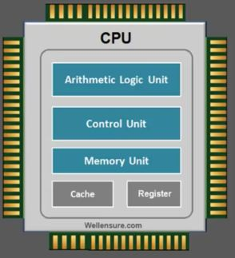

## O que é Assembly?

Assembly ou linguagem de montagem é uma **linguagem de programação**, assim como C, Python, JavaScript, etc. Porém se destaca por ser a linguagem mais próxima do código que o processador realmente executa. O C abstrai muitas das operações.

Tome como exemplo a operação de declarar uma variável no C: `int a = 10`. Você acha mesmo que o processador apenas recebe isso e já tem um lugar pronto para a variável `a`, uma caixinha onde é guardado 10? Não, muito longe disso. Uma série de operações que o processador realmente executa são escondidas de você, para simplificar o trabalho do programador.

Algumas linguagens de programação abstraem mais do que outras. O Assembly é **muito próximo do código de máquina, muito verboso**. O C já abstrai mais, mas é rígido e permite manipulação de memória. Já o Python seria o "nível mais fácil" das linguagens de programação, pois tem inúmeras funcionalidades prontas que facilitam seu trabalho.

Podemos ver isso com a operação de soma de dois números.

Código de máquina:
```Bin
01001000 11000111 11000111 00000101 00000000 00000000 00000000
01001000 11000111 11000110 00000011 00000000 00000000 00000000
01001000 00000001 11110111
```
Código de máquina em hexadecimal (cada hexadecimal representa 1 byte. Se acostume com isso, pois analisamos informações na memória desse jeito, o famoso `hexdump`):
```hex
48 c7 c7 05 00 00 00 48 c7 c6 03 00 00 00 48 01 f7
```
Código em Assembly:
```Assembly
mov rdi, 0x5
mov rsi, 0x3 
add rdi, rsi
```
Código em C:
```C
int a = 5;
int b = 3;
int resultado = a + b;
```
Código em Python:
```py
resultado = 5 + 3
```

Não há linguagem de programação melhor do que outra, apenas aquela que é uma ferramenta boa para você. Python oferece agilidade, enquanto C oferece otimização e robustez, ao passo que Assembly é próxima do código de máquina, útil para otimização e também análise de Engenharia Reversa, como veremos aqui.

O Assembly possui **acesso direto ao hardware**, de modo que permite manipular diretamente os registradores da CPU (falaremos mais à frente sobre isso). Cada instrução (linha) de um código Assembly geralmente corresponde a uma única instrução de máquina, assim temos uma proporção 1:1, algo que não acontece no C e Python.

## Por que Assembly?

Todo código, qualquer que seja a linguagem, é compilado e transformado em código de máquina. Engenharia reversa é a arte de abrir esses binários e entendê-los, e para isso precisamos entender a sintaxe do Assembly, pois ela torna o código de máquina legível. Ou seja, ela traduz 0 e 1 em instruções que podemos entender. O assembly não é tão trivial, mas uma vez que você se acostuma, te ajuda perfeitamente a entender quealquer binário.

Além disso, as vulnerabilidades que são exploradas aqui e em CTF's geralmente necessitam que  exploremos o Assembly e a organização interna do código, para ver como podemos abusar dessa estrutura.

## Registradores

Registradores são **locais de memória temporária dentro do processador**. Eles possuem uma **quantidade pequena de memória**, em geral 8 bytes, mas possuem **alta velocidade de acesso e operação** (muito mais rápido que memḿoria RAM).

Basicamente, os registradores são utilizados para armazenar informação útil, como valores de variáveis, endereços de memória para outros lugares (ponteiros), etc. Os registradores sempre estarão presentes em código assembly, pois enviar valores diretamente para registradores no processador é o modo mais otimizado de se realizar uma operação.

<div style={{textAlign: 'center'}}>
    
</div>

Na **arquitetura x64 (64 bits = 8 bytes)**, os registradores da CPU do computador **possuem 8 bytes cada**. Na **arquitetura x86 (32 bits = 4 bytes)**, os registradores possuem **4 bytes cada**. Cada programa **.exe** (ou qualquer outra extensão em código de máquina) segue uma dessas duas arquiteturas.

Abaixo, temos uma lista de registradores e do modo como cada um é usado em um programa.

| 8 Byte Register | Lower 4 Bytes | Lower 2 Bytes | Lower Byte | Uso principal |
|-----------------|---------------|---------------|------------|---------------|
|   rbp           |     ebp       |     bp        |     bpl    |Base Pointer (Ponteiro de Base do Frame da Pilha)|
|   rsp           |     esp       |     sp        |     spl    |Stack Pointer (Ponteiro do Topo da Pilha)
|   rip           |     eip       |     (N/A)          |   (N/A)         |Instruction Pointer (Ponteiro da Próxima Instrução)
|   rax           |     eax       |     ax        |     al     |Acumulador (Valor de Retorno, Operações Aritméticas)
|   rbx           |     ebx       |     bx        |     bl     |Base (Ponteiro de Dados, Valor Preservado em Chamadas)
|   rcx           |     ecx       |     cx        |     cl     |Contador (Contador para Loops/Shifts, 3º Argumento)
|   rdx           |     edx       |     dx        |     dl     |Dados (Extensão do Acumulador, 4º Argumento)
|   rsi           |     esi       |     si        |     sil    |Source Index (Ponteiro Fonte para Operações de String/Memória, 2º Argumento)
|   rdi           |     edi       |     di        |     dil    |Destination Index (Ponteiro Destino para String/Memória, 1º Argumento)
|   r8            |     r8d       |     r8w       |     r8b    |5º Argumento de Função (Uso Geral)
|   r9            |     r9d       |     r9w       |     r9b    |6º Argumento de Função (Uso Geral)
|   r10           |     r10d      |     r10w      |     r10b   |Temporário (Uso Geral, Não Preservado em Chamadas)
|   r11           |     r11d      |     r11w      |     r11b   |Temporário (Uso Geral, Não Preservado em Chamadas)
|   r12           |     r12d      |     r12w      |     r12b   |Local (Uso Geral, Preservado em Chamadas)
|   r13           |     r13d      |     r13w      |     r13b   |Local (Uso Geral, Preservado em Chamadas)
|   r14           |     r14d      |     r14w      |     r14b   |Local (Uso Geral, Preservado em Chamadas)
|   r15           |     r15d      |     r15w      |     r15b   |Local (Uso Geral, Preservado em Chamadas)

OBS: O modo como os registradores são usados como argumentos de funções mudam para cada arquitetura. Mais adiante explicaremos o que é Stack.


|Arquitetura e Sistema Operacional	|Convenção de Chamada	|Registradores para Parâmetros (Inteiros/Ponteiros)	|Parâmetros Excedentes|
|-----------------------------------|-----------------------|------------------------------------------------------|---------------------|
|**x86-64 (Linux/macOS/BSD)**|	System V AMD64 ABI	|1º: RDI|
|||2º: RSI|
|||3º: RDX|
|||4º: RCX|
|||5º: R8|
|||6º: R9| Vão para a Stack (push da direita para esquerda).
|**x86-64 (Windows)**|	Microsoft x64 ABI	|1º: RCX
|||2º: RDX|
|||3º: R8|
|||4º: R9	|Vão para a Stack. Espaço de "shadow store" é reservado na pilha para os primeiros quatro parâmetros, mesmo que a função não use parâmetros.
|**x86 (32-bit)**|	cdecl (Linux)	|Todos os parâmetros vão para a Stack (push da direita para esquerda). | Não se aplica.
|**x86 (32-bit)**| stdcall (WinAPI)	|Todos os parâmetros vão para a Stack (push da direita para esquerda).	| Não se aplica.
|**ARM (AArch64)**	|AAPCS64	|1º-8º: X0-X7	|Vão para a pilha.
|**ARM (AArch32)**	|AAPCS	|1º-4º: R0-R3	|Vão para a pilha.

Neste guia, utilizaremos a convenção Linux de 32-bit e 64-bit para analisar registradores e stack. Mas o que muda é apenas a convenção.

## Flags

**Existe um registrador que contém flags**, o **RFLAGS** (x64 = 64 bits) ou **EFLAGS** (x86 = 32 bits). Cada bit do registrador é uma flag diferente.

| Bit | Flag|
|-----|-----|
|00   | Carry Flag
|01|     always 1
|02|     Parity Flag
|03|     always 0
|04|     Adjust Flag
|05|     always 0
|06|     Zero Flag
|07|     Sign Flag
|08|     Trap Flag
|09|     Interruption Flag     
|10|     Direction Flag
|11|     Overflow Flag
|12|     I/O Privilege Field lower bit
|13|     I/O Privilege Field higher bit
|14|     Nested Task Flag
|15|     Resume Flag

Esse registrador é usado, por exemplo, para a operação de comparar se dois números são iguais. Para verificar se `a > b`:

-  `cmp a, b` (instrução assembly)
    - Faz `a - b`
    - Se dá zero, **Zero Flag** (bit 06) fica como `1`.
    - Se dá diferente de zero, **Zero Flag** (bit 06) fica como `0`.
        - Se dá negativo, **Sign Flag** (bit 07) fica como `1`
        - Se dá positivo, **Sign Flag** (bit 07) fica como `0`
- Resultado da subtração é descartado, mas as Flags são utilizadas como referência para os próximos passos.

Isso sempre irá ocorrer quando houver um `IF/ELSE`, por exemplo, no código original.

## Instruções Assembly comuns

### Words

Words não são comandos, mas indicam o tamanho do tipo de dado em Assembly.

- WORD = **2 bytes de dados**.
- DWORD = **4 bytes de dados**.
- QWORD = **8 bytes de dados**.

### Comentários

Para comentários, usa-se `;`

### mov

**Move dados de um registrador para outro** (segundo para o primeiro). 

Ex: `mov rax, rdx` (move dados de rdx para rax)

### dereference

**colchetes referenciam dados ao qual um ponteiro aponta**. Ou seja, se `RBP-0x8` = `0xfffff72c` (endereço), então `[RBP-0x8]` = 10 (valor da variável).

Ex: `mov rax, [rdx]`

### lea

**Calcula o endereço do segundo operando**, e move para o primeiro.

Ex: `lea rdi, [rbx+0x10]` (move o endereço rbx+0x10 para o registrador rdi)

### add

**Adiciona dois valores** e armazena no primeiro operando.

Ex: `add rax, rdx` (rax = rax + rdx)

### sub

**Subtrai o segundo operando do primeiro** e armazena no primeiro.

Ex: `sub rsp, 0x10` (`rsp` = `rsp` - `0x10`)

### xor

**Faz o xor nos dois argumentos**, e armazena no primeiro operando. and e or são semelhantes.

Ex: `xor rdx, rax`

### push

**Cresce a stack em 8 ou 4 bytes** (para x64, ou 4 para x86), **depois** **adiciona o conteúdo do registrador para o topo da stack**

Ex: `push rax`

### pop

Tira 8 bytes do topo da stack e armazena no argumento. Depois encolhe a stack.

Ex: `pop rax` (Retira dado do topo da Stack e armazena em RAX)

### jmp

**Pula para um endereço de instrução**. Redireciona a execução do código.

Ex: `jmp 0x60201012`

É uma redução de código, e é igual a:

`mov RIP, 0x60201012`

(Alterar o RIP altera onde o código estará sendo executado)

### call

É uma redução de dois comandos. Utilizado sempre que se chama uma função no código.

1. `push RIP` - empilha Return Address na stack. É o endereço de retorno da PRÓXIMA instrução a ser executada na função atual quando a nova função retornar.
2. `jmp function`- Salta para as linhas de instrução da nova função.

### ret

Depois que a função finaliza, **a instrução `ret` é chamada**. Ela consiste em uma redução de comando:

`pop RIP` - Desempilha topo da stack (que deve ser o return address) e coloca no RIP (registrador que guarda o endereço de onde está sendo executado código)

Você pode se perguntar: Mas o topo da stack não tem as variáveis, RBP antigo, etc? Sim, exato. Por isso, antes da função finalizar, temos ajustes na stack:

```assembly
mov RBP, RSP ; RSP (topo da stack) agora é RBP, que contém endereço do RBP da função anterior

pop RBP ; Faz o pop, restaurando o endereço do RBP da função anterior
ret
```

(OBS: `;` é um **comentário** em assembly)

E o que acontece com as variáveis e todas as outras coisas que estavam na stack da função? Ficam lá, como lixo de memória, sem serem modificadas, até que um programa sobrescreva elas.

### cmp

**Compara dois operandos, faz o primeiro menos o segundo e checa se o resultado é maior/menor/igual a zero**. Dependendo do valor, define uma flag de acordo.

Ex: `cmp RAX, 0x10`

### jnz/jz (jumpt if not zero/jump if zero)

Similar ao `jmp`. Mas apenas executa dependendo do status da zero flag.

Existem outros, como `jle` (jump if less or equal).