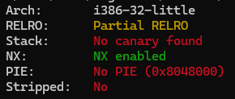

Os arquivos binários possuem, por padrão, algumas proteções ativadas que dificultam bastante a exploração de vulnerabilidades. É importante saber quais são e o que fazem, pois há ataques que não são possíveis dependendo da proteção, ou ficam muito mais difíceis. Apesar disso, há modos de contornar cada uma.

## Verificando as proteções de um arquivo

Instale o pacote `checksec`: 

1. `sudo apt install checksec`
2. `sudo pip install pwntools` (se o erro de "This environment is externally managed", use `sudo pip install --break-system-packages pwntools`)

Verifique um binário com `checksec ./arquivo`. Este comando retorna uma info das proteções do binário, como abaixo.

    

**Arch** indica a arquitetura do arquivo. `i386` é a família/modelo do processoador (processadores Intel de 32 bits), `32` indica que os endereços possuem 32 bits (`x86`), `little` indica o [Endianness](/docs/introduction/endianness), ou seja, little-endian.

**Stripped** é o quanto dos símbolos originais foram perdidos, melhor explicado no módulo [Debugging com GDB](/docs/introduction/gdb#compilando-sem--g--stripped).

Os outros são as proteções que veremos a seguir.

## RELRO (Relocation Read-Only)

**Funcionamento**

Controla as permissões de escrita em tabelas de dados que contêm ponteiros para funções externas: o GOT (Global Offset Table) e o PLT (Procedure Linkage Table).

- **Partial RELRO**: Apenas algumas partes são protegidas; o GOT é escrito após a resolução de funções (LAZY BINDING) e permanece gravável.
- **Full RELRO**: Todas as relocations são processadas na inicialização (EAGER BINDING). Após a inicialização, todo o GOT se torna somente leitura (read-only).

**Efeito**

Impede ataques que visam modificar ponteiros em áreas de realocação, como GOT (Global Offset Table) e PLT.

**Contorno**

- **Partial RELRO**: Permite Lazy Binding, o GOT é gravável (rw) porque é atualizado em tempo de execução quando uma função externa é chamada pela primeira vez. **Modifique o GOT antes que a função a ser explorada seja chamada pela segunda vez**.
- **Full RELRO**: Extremamente difícil ou impossível modificar o GOT diretamente. O ataque deve focar em técnicas que não envolvam a escrita no GOT.

## Stack Canary/SSP (Stack-Smashing Protector)

**Funcionamento**

1. O compilador insere um valor aleatório de 4 ou 8 bytes (o Canary) no Stack Frame da função, imediatamente antes do endereço de retorno salvo.
2. O valor do Canary é armazenado em uma área de memória segura.
3. **Antes de a função retornar**, o código gerado pelo compilador verifica se o Canary na Stack corresponde ao valor armazenado.
4. Se a verificação falhar, o programa aborta o processo.

**Efeito**

Impede sobrescrita do `return address` na stack. **Eficaz contra Buffer Overflow**.

**Contorno**

**Vazar o Canary** (endereço de verificação do Stack Canary), **mantendo o valor que ele usa como verificação na stack ao fazer o padding no Buffer Overflow**. Ou sobrescrever ponteiros de função na Heap (Heap Overflow) ou em áreas não protegidas pelo Canary.

## NX (No-Execute) ou DEP (Data Execution Prevention)

**Funcionamento**

Recurso de hardware (CPU) e software (SO). Um bit na entrada da tabela de páginas de memória (`Page Table Entry - PTE`) é marcado. Se o bit NX estiver ativado (1), **o processador não permitirá a busca e execução de instruções nessa página de memória, mesmo que o código tente saltar para lá**.

**Efeito**

Impede com que áreas da memória que deveriam conter apenas dados sejam executadas. **Eficaz contra injeção de Shellcode na Stack/Heap**.

**Contorno**: Usar ROP (Return-Oriented Programming) ou JOP (Jump-Oriented Programming), que reutilizam código do próprio programa, estes estando em áreas com permissão de execução. 

## PIE (Position-Independent Executable) + ASLR (Address Space Layout Randomization)

**Funcionamento**

Na inicialização do processo, o sistema operacional carrega a base do executável, bibliotecas compartilhadas (como `libc`), a Stack e a Heap em **endereços de memória aleatórios e diferentes a cada execução**.

Enquanto PIE é desativado ao compilar o binário, o ASLR é um configuração do Kernel/Sistema Operacional (afeta os endereços da `libc`).

**Efeito**

Endereços do executável randomizados toda vez que ele roda. Mesmo que você tenha o executável, os endereços que você obtiver serão inúteis na máquina alvo, onde você tem apenas um `input` e mais nada.

**Contorno**

Vazar endereços (Format strings, Array Indexing, etc).

## Fortify Source

Recurso do compilador (GCC/Clang) que substitui chamadas a funções C inseguras (strcpy, memcpy, snprintf) por versões mais seguras em tempo de compilação. Essas versões verificam se o tamanho de destino fornecido pelo programador é excedido e, se houver um estouro, encerram o programa. Essa proteção é aplicada na compilação de C/Python/Outro para código de máquina.

**Efeito**

Ajuda a evitar alguns Buffer Overflows simples, mas apenas se o compilador conseguir determinar o tamanho do buffer de destino.

## IBT (Indirect Branch Tracking)

O IBT (Indirect Branch Tracking) é uma proteção de hardware contra ataques de redirecionamento de fluxo de execução. Visa prevenir ataques ROP e JOP.

Com IBT, temos duas novas instruções: `endbr32` (32-bit) e `endbr64` (64 bit)

Essas instruções são NOPs que não fazem nada durante a execução normal, mas são verificadas pelo hardware quando ocorre um salto indireto (`jmp` ou `call`).

Assim, o compilador insere ENDBR no início de funções, destinos de ponteiros de função, etc (destinos válidos!). Se um `jmp` ou `call` não leva o RIP até um ENDBR primeiro, ocorre uma falha e o programa encerra.

**Efeito**

Isso limita 99% das aplicações práticas de ROP e JOP.

**Contorno**

Usar gadgets que começam com ENDBR (destino válido).