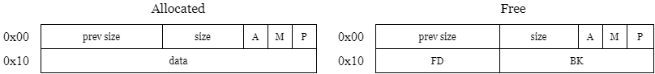

Um Double-free é bem simples.

Primeiro, lembre-se que para cada chunk na fastbin, a localização do próximo chunk é dada pelo ponteiro `fd` do chunk atual. Se o chunk `a` possui um ponteiro `a->fd` que aponta para `b`, então uma vez que `a` for liberado, `b` passa a ser o próximo chunk a ser liberado.

Em um double free, tentamos controlar `fd`. Sobrescrevendo isso com um endereço de memória arbitrário, podemos falar ao `malloc` onde o próximo chunk será alocado. Sim, podemos fazer o `malloc` considerar qualquer lugar da memória um chunk!

## Controlando fd

Para explorarmos um double-free, precisamos que o mesmo chunk seja liberado **duas vezes**.

```c
char *a = malloc(0x20);
free(a);
free(a);
```

Lembre-se que os chunks só vão para as bins após serem liberados. Abaixo temos uma simulação da fast bin.

1. Antes do free: `HEAD`
2. Depois do 1° free: `HEAD->a`
3. Depois do 2° free: `HEAD->a->a`

O que acontece agora se chamarmos `malloc()` para alocar um chunk do mesmo tamanho de `a` (que foi liberado)? Bom, como já conhecemos como as bins funcionam, isso quer dizer que o primeiro `a` colocado vai sair da fast bin e ser alocado. Porém, o outro `a` permanece.

Assim, `a` está alocado e livre ao mesmo tempo (estranho).

Caso você não se lembre, por questão de economia de memória, a heap coloca o ponteiro `fd` (para um chunk livre) onde normalmente os dados colocados pelo usuário estariam.

<div style={{textAlign: 'center', fontSize: '0.8rem'}}>
    
    <p>Fonte: <a href="https://ir0nstone.gitbook.io/notes/binexp/heap/double-free" target="_blank">Ir0nstone</a></p>
</div>

Entendeu? Após um Double-Free, se recuperarmos exatamente o mesmo tamanho de chunk `a` que foi liberado duas vezes, e escrevermos 8 bytes quaisquer, estaremos escrevendo o `fd` que indica qual o próximo chunk a ser alocado.

Agora, o próximo `malloc` vai retornar o endereço de `a` de novo. Isso não importa, queremos o próximo.

```c
malloc(0x20)                     // Apenas outro 'a'
char *controlled = malloc(0x20); // A localização que queremos
```

Boom, temos escrita arbitrária nesse endereço.

## Passo a Passo

1. Verificar se existe double free
2. Fazer double free acontecer
3. Alocar chunk do mesmo tamanho do que foi liberado
4. Inserir payload (endereço para onde queremos ir) como dados no chunk que acabamos de alocar (`strcpy(b, "\x78\x56\x34\x12")`, por exemplo)
5. Alocar outro chunk do mesmo tamanho. O ponteiro retornado para esse chunk alocado agora aponta para o endereço onde queríamos ir.

## Proteções

### Fasttop (Double Free check)

É uma proteção bem simples e fácil de ser quebrada. Ela verifica: "o chunk que está no topo da bin é o mesmo sendo liberado?"

Mas basta liberar outro chunk entre o double free (técnica do chunk intermediário):

```c
#include <stdio.h>
#include <stdlib.h>

int main() {
    int *a = malloc(0x50);
    int *b = malloc(0x50);

    free(a);
    free(b); // Isso quebra o fluxo
    free(a); // Ainda é um double free 
    
    return 1;
}
```

### Size Check (malloc)

Essa proteção já é mais difícil de passar. Quando o `malloc` remove (aloca) um chunk da fastbin, irá ser verificado o campo `size` armazenado nos metadados do chunk para constar se corresponde ao tamanho esperado de um chunk da fastbin.

Supondo que redirecionamos `fd` para `0x12345678`, se em `0x12345678 - 8` (onde fica o size) não houver um valor que corresponda ao tamanho esperado da fastbin, temos **memory corruption** no `malloc`.

Isso nos força a encontrar endereços-alvo onde os bytes pareçam metadados válidos, e um GOT Overwrite, por exemplo, se torna mais difícil.