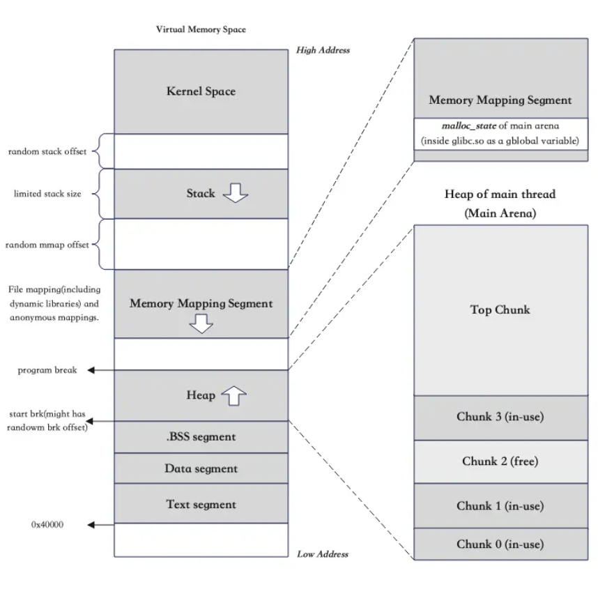
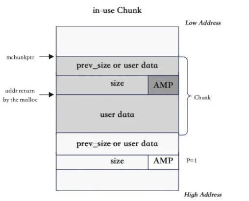
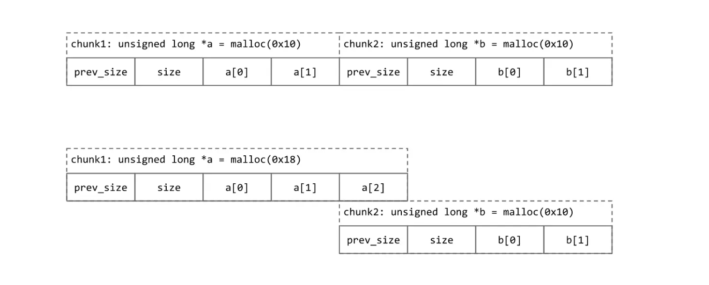
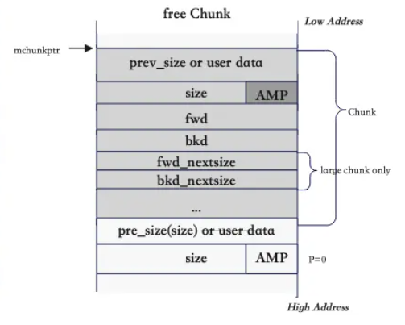

## O que é Heap?

A heap é uma área de memória diferente da stack. Nela, variáveis podem ser dinamicamente alocadas. Enquanto variáveis locais são criadas e destruídas toda vez que você entra/sai de uma função, a heap permanece até o fim do programa. Se a stack é criada automaticamente, a heap é criada manualmente pelo programador. Isso abre bastante margem de erro e exploração de vulnerabilidades.

Por exemplo:

```c
int funcao{
    int x = 10; // Essa variável vai sumir quando a função retornar, está na stack.

    int *array = malloc(4 * sizeof(int)); // Reservamos (alocamos) espaço para quatro inteiros. Recemos de volta um ponteiro.
    array[0] = 101; // Acessamos o ponteiro e definimos valor = 101 no endereço na heap.
    array[1] = 102; // Acessamos o ponteiro e definimos valor = 102 no endereço na heap.

    free(array); // Procedimento padrão: liberamos o espaço alocado

    // Da mesma forma, para variável simples
    int *y = malloc(sizeof(int));
    y* = 15;

    free(y)
}
```

No C, podemos alocar memória com:

- `malloc(n)` - Aloca n bytes de memória. Se pedimos 4 bytes (um inteiro), teremos 4 bytes reservados na heap. O malloc aloca do jeito que está, então se temos inicialmente `0x41256112` na heap (lixo de memória), o lixo continua ali.
- `calloc(n)` - Aloca n bytes de memória, mas preenche com zeros o local onde alocamos.

O que `malloc` e `calloc` retornam é um ponteiro. Ou seja:

1. `malloc(4)`
2. Pedimos para reservar 4 bytes de memória na heap
3. malloc reserva e retorna o ponteiro/endereço do início da memória reservada. Uma variável `y` recebe esse ponteiro/endereço.
4. quando fazemos `y* = 15`, o `*` acessa o endereço de `y` e coloca nosso dado lá. O lixo que estava lá some após essa atribuição.
5. Quando fazemos `free(y)`, dizemos ao programa que aquele espaço na heap não vai ser mais usado. Assim, outra variável pode ocupar esse espaço futuramente.

```
Heap antes do malloc:
[ lixo | lixo | lixo | lixo | lixo | ... ]

Após malloc(4):
[y] -> [  ][  ][  ][  ]   // 4 bytes contendo lixo
       ↑
       y aponta para aqui

Após *y = 15 (se y for int*):
[y] -> [0x00][0x00][0x00][0x0F]  // 15 em little-endian
```

A heap cresce de tamanho conforme a necessidade, e é o programador que decide quando criar/destruir variáveis. Os dados podem durar até o fim do programa, independente de onde estivermos na execução. Outra vantagem é que a stack tem tamanho limitado (~8MB no Linux) enquanto os dados na heap podem ser muito grandes e complexos.

## Funcionamento da Heap

### Heap na memória do processo

A heap é um espaço contínuo na memória. Enquanto a stack cresce para endereços mais baixos, a heap cresce para endereços mais altos.

Para um processo qualquer (programa), temos a seguinte organização na memória:

<div style={{textAlign: 'center'}}>
    
</div>

O Memory mapping Segment (ou mmap region) é uma área da memória virtual onde arquivos e bibliotecas são mapeados para dentro do espaço de memória do processo, permitindo acesso direto como se fossem memória RAM. No Memory Mapping Segment, colocamos:

- bibliotecas/bibliotecas compartilhadas
- arquivos mapeados
- alocações grandes via `mmap()` (veremos mais adiante)

Já no espaço da heap temos os chunks, que são as alocações pequenas que fazemos na heap (explicarei mais adiante).

### Dentro do malloc

O malloc usa system calls internas que criam um novo espaço de memória.

- `brk/sbrk` - Controlam o limite superior da heap de um processo. Existe um ponto na memória chamado `program break` (vide imagem), que marca o fim da heap. Tudo abaixo desse ponto é memória alocada, tudo acima é espaço livre. Usar `brk` é dizer "mova o `program break`".
    - Isso traz problemas. Imagine que você aloca A, B, C e depois libera B. Agora tem um buraco no meio da heap (fragmentação). Se você tentar alocar algo maior que o buraco, a alocação pode falhar pois não há um bloco contínuo grande o suficiente.
    - Devido a isso, `brk/sbrk` são usadas internamente pelo `malloc` apenas para alocações pequenas e médias (até 128 KB).
- `mmap` - Enquanto `brk` só mexe na heap, `mmap` pode criar mapeamentos de memória independentes em qualquer lugar do espaço do Memory Mapping Segment.
    - `mmap` não armazena de maneira contínua na memória, cada alocação fica isolada. O kernel Linux gerencia cada mmap como uma Área de memória virtual separada.
    - Quando alocamos com `mmap`, recebemos uma região separada da heap tradicional. Quando liberamos com `munmap`, devolvemos toda a região ao SO de uma vez. O fato da alocação não ser contínua igual o `brk` elimina o problema de fragmentação.

```
Com brk (contínuo):
[MapA: 4KB][MapB: 4KB][MapC: 4KB]  ← Tudo alocado
free(MapB)
[MapA: 4KB][LIVRE: 4KB][MapC: 4KB]  ← Buraco!

Mas com mmap NÃO É ASSIM:

Estado REAL do mmap:
Endereço 0x1000: [MapA: 4KB]
Endereço 0x5000: [MapB: 4KB]  ← Não é contínuo com A!
Endereço 0x9000: [MapC: 4KB]

munmap(MapB):
Endereço 0x1000: [MapA: 4KB]
Endereço 0x5000: [~~~~~~ ESPAÇO REMOVIDO ~~~~~~]
Endereço 0x9000: [MapC: 4KB]
```

Para alocações pequenas (até 128 KB), o malloc usa a heap tradicional via `brk`.
Para alocações grandes (acima de 128 KB), o malloc usa `mmap` diretamente. Isso evita fragmentar a heap principal com blocos blocos enormes.

Você pode ver essa diferença na prática: se você alocar 100 bytes com malloc(), o endereço retornado estará próximo do início do espaço de memória (na região da heap tradicional). Se você alocar 200KB, o endereço estará em uma região completamente diferente (no memory mapping segment), muito mais próximo da stack.

### Chunks

Na heap, alocamos de maneira contínua na memória (um atrás do outro). Os espaços disponíveis/alocados na heap são representados por **chunks** (blocos), que contém a região de memória com informações internas e espaço para os dados que você irá colocar ali.

Se alocamos memória com `malloc`, um chunk armazena metadados e nossos dados ali. Se há espaço na heap sem memória em uso, mas entre dois chunks em uso, por exemplo, esse espaço livre será um `free chunk` (chunk livre).

Internamente, todo chunk é armazenado em uma struct [`malloc_chunk`](https://elixir.bootlin.com/glibc/glibc-2.39/source/malloc/malloc.c#L1136):

```c
struct malloc_chunk {

  INTERNAL_SIZE_T      mchunk_prev_size;  /* Size of previous chunk (if free).  */
  INTERNAL_SIZE_T      mchunk_size;       /* Size in bytes, including overhead. */

  struct malloc_chunk* fd;         /* double links -- used only if free. */
  struct malloc_chunk* bk;

  /* Only used for large blocks: pointer to next larger size.  */
  struct malloc_chunk* fd_nextsize; /* double links -- used only if free. */
  struct malloc_chunk* bk_nextsize;
};

typedef struct malloc_chunk* mchunkptr;
``` 

A diferença entre chunks alocados e livres é como o espaço de memória é usado.

#### Chunks alocados (em uso)

Um chunk alocado consiste de 4 partes:

<div style={{textAlign: 'center'}}>
    
</div>

1. `prev_size` ou `user_data` - Se o chunk anterior adjascente estiver livre, contém o seu tamanho. Caso o chunk anterior adjascente esteja ocupado, a heap economiza espaço, **"doando" esses 8 bytes (para 64 bits) para o chunk adjascente anterior**. Abaixo, vemos um exemplo disso.

<div style={{textAlign: 'center'}}>
    
</div>

2. `size` com `AMP` - Contém tamanho do chunk atual. Tanto em 32 quanto 64 bits, deve ser um múltiplo de 4 ou 8. Assim, os últimos 3 bits nunca são usados, e usam-se eles para verificar 3 flags:
    1. `A`, NON_MAIN_ARENA - A arena principal usa a heap da aplicação. Outras arenas usam mmap'd heaps. Se o bit é 0, o chunk vem da main arena e da main heap. Se é 1, o chunk vem de mmap'd memory e a localização da heap pode ser computada a partir do endereço do chunk.
    2. `M`, IS_MAPPED - Se o bit é 1, o chunk foi alocado com `mmap` e não faz parte da heap.
    3. `P`, PREV_INUSE - Se o bit é 1, o chunk anterior (adjascente) está sendo usado. Caso seja 0, o chunk anterior está livre.
4. `user_data` - Contém os dados que o programa quiser guardar. O endereço retornado pelo `malloc` é o início de `user_data`.

Assim, para chunks alocados:

```
0x00: prev_size ou user_data  // Depende do uso do chunk anterior
0x08: size       // Tamanho + flags (A|M|P)
0x10: user_data  // Início dos dados do usuário
```

#### Chunks livres

Um chunk livre consiste de 4 partes:

<div style={{textAlign: 'center'}}>
    
</div>

1. `prev_size` ou `user_data` - Já comentado
2. `size` com `AMP` - Já comentado
3. `fwd`, `bkd`
    1. `fwd` - Endereço do próximo chunk livre
    2. `bkd` - Endereço do chunk livre anterior 
5. `fwd_nextsize`, `bkd_nextsize` - Usados para otimizar a busca por chunks livres apenas nos **large bins**. 
    1. `fwd_nextsize` - Endereço para o próximo chunk na lista de tamanhos, sendo este **menor** que o chunk atual
    2. `bkd_nextsize` - Endereço para o chunk anterior na lista de tamanhos, sendo este **maior** que o chunk atual.

Exemplo para `fwd_nextsize` e `bkd_nextsize`:

```
Large Bin (tamanhos: 1024, 1024, 512, 256, 256, 128)

Lista principal (fd/bk):
[1024-A] <-> [1024-B] <-> [512] <-> [256-A] <-> [256-B] <-> [128]

Lista nextsize (fwd_nextsize/bkd_nextsize):
[1024-A] <-> [512] <-> [256-A] <-> [128]
   ↑           ↑         ↑           ↑
(primeiro    (único)   (primeiro)  (único)
 de 1024)               de 256)
```

### Binning

Bins são listas organizadas de chunks livres no gerenciador de memória do glibc (ptmalloc2). Eles funcionam como cache para alocações futuras, reduzindo a fragmentação e melhorando o desempenho. Cada tipo de bin tem características específicas para diferentes padrões de uso de memória.

**Quando um chunk é liberado, ele é colocado em um bin**. O movimento não é real, **apenas um ponteiro a este chunk é armazenado na lista (bin)**. A estrutura de um chunk livre também varia dependendo do bin onde ele está armazenado.

#### Fast Bins

Armazenam chunks pequenos em uma lista simples encadeada. Os chunks, **muito pequenos**, **são reusados rapidamente e de modo eficiente**. Devido a isso, chunks na fastbin não se consolidam (não são absorvidos por chunks livres próximos, de modo a formar um maior), apenas em casos extremos (explicados mais adiante).

- **Localização**: `fastbinsY[]` (Os fast bins não ficam com os outros bins em `bins[]`)
- **Faixa de tamanhos**: 16 a 80 bytes (arquitetura x86) ou 32 a 160 bytes (arquitetura x64)
- **Número de bins**: 10 bins (padrão no glibc moderno), cada bin possuindo uma faixa de tamanhos diferentes (em bytes).
- **Estrutura**: LIFO - Last In First Out - O chunk mais novo é o primeiro a ser alocado. `HEAD` aponta para o primeiro chunk e é `0` se o fastbin está vazio. É uma lista encadeada simples (só `fd`)

Chunk livre em fast bins:

```
+---------------+---------------+
| prev_size     | size (AMP)    |  <- Header
+---------------+---------------+
| fd            |               |  <- Corpo do chunk livre (bwd não existe)
+---------------+---------------+
|                               |
|          Espaço útil          |
+---------------+---------------+
```

Organização por Tamanho do chunk:

| Índice | Tamanho (x86) | Tamanho (x64) |
|--------|---------------|---------------|
| fastbinsY[0] | 0x20 - 0x2f bytes | 0x40 - 0x4f bytes |
| fastbinsY[1] | 0x30 - 0x3f bytes | 0x50 - 0x5f bytes |
| fastbinsY[2] | 0x40 - 0x4f bytes | 0x60 - 0x6f bytes |
| ... | ... | ... | ... |

Podemos ver tudo isso na prática:

```c
#include <stdio.h>
#include <stdlib.h>

int main() {
    char *a = malloc(20);
    char *b = malloc(20);
    char *c = malloc(20);
    
    printf("a: %p\nb: %p\nc: %p\n", a, b, c);

    puts("Freeing...");

    free(a);
    free(b);
    free(c);

    puts("Allocating...");

    char *d = malloc(20);
    char *e = malloc(20);
    char *f = malloc(20);

    printf("d: %p\ne: %p\nf: %p\n", d, e, f);
}
```

Conseguimos:

```
a: 0x55bbef0072a0
b: 0x55bbef0072c0
c: 0x55bbef0072e0
Freeing...
Allocating...
d: 0x55bbef0072e0
e: 0x55bbef0072c0
f: 0x55bbef0072a0
```

Como você pode ver, o chunk `a` foi realocado para o chunk `f`, `b` para `e` e `c` para `d`. Então, se damos `free()` em um chance, há uma boa chance de nosso próximo `malloc` - se for do mesmo tamanho - usar o mesmo chunk.

Quando damos free, o chunk entra na lista do fast bin. **Cada free empurra o chunk que estava em HEAD para baixo**. Quando solicitamos um chunk do fast bin para usar, **o primeiro a ser chamado é justamente o último a ser inserido!** (inserimos em HEAD, retiramos de HEAD)

```
VISÂO DO FASTBINSY[0] FAZENDO LIFO

# Início
HEAD -> NULL

# free(a)
HEAD -> a

# free(b)
HEAD -> b -> a

# free(c)
HEAD -> c -> b -> a

# malloc(d)
HEAD -> b -> a

# malloc(e)
HEAD -> a

# malloc(f)
HEAD -> NULL
```

Lembre-se de que `HEAD -> a` significa que a variável HEAD possui o endereço do chunk `a`.

Pode ser confuso inserirmos no começo e não no fim, o que seria visualmente bonitinho. Mas como o fastbin só tem HEAD e não tem TAIL, toda vez que fosse inserir no final teria de percorrer toda a lista, o que não é otimizado (imagine ter que percorrer 1 milhão de chunks a cada alocação). Com isto, gastamos só 1 operação, a de fazer HEAD apontar para o novo chunk. Isso explica porque trocamos a ordem dos chunks realocados.

#### Unsorted Bin

- **Localização**: `bins[1]` (índice 1 do array de bins)
- **Estrutura**: Lista encadeada dupla circular (`fd` e `bk`, e o último elemento aponta para o primeiro, e vice-versa)
- **Propósito**: Lista temporária para chunks recém-libertados que não são rápidos (não vão pro fast bin)

Chunk livre em unsorted bin:

```
+---------------+---------------+
| prev_size     | size (AMP)    |  <- Header
+---------------+---------------+
| fd            | bk            |  <- Corpo do chunk livre
+---------------+---------------+
|                               |
|          Espaço útil          |
+---------------+---------------+
```

Funcionamento:

1. **Ponto de entrada**: Quando um chunk é liberado (`free()`), ele normalmente vai primeiro para o unsorted bin
2. **Processamento**: Durante chamadas subsequentes a `malloc()`, o allocator percorre o unsorted bin para tentar reutilizar chunks
3. **Ordenação**: Se um chunk no unsorted bin for adequado para uma requisição, é usado; caso contrário, é movido para o small ou large bin apropriado

#### Small Bins

- **Número de bins**: 62 bins (índices 2 a 63 no array de bins)
- **Estrutura**: FIFO - First In First Out - O chunk mais antigo é o primeiro a sair.
- **Faixa de tamanhos**: 32 - 1008 bytes (bin[2] - [63]) (em x64)
- **Coalescimento**: Chunks adjacentes podem ser unidos quando livres
- **Relação com fast bins**: Chunks de tamanhos equivalentes podem existir tanto em fast bins quanto em small bins

Chunk livre em small bin (igual ao unsorted):

```
+---------------+---------------+
| prev_size     | size (AMP)    |  <- Header
+---------------+---------------+
| fd            | bk            |  <- Corpo do chunk livre
+---------------+---------------+
|                               |
|          Espaço útil          |
+---------------+---------------+
```

Cada small bin armazena chunks de tamanho exato:
- **Bin 2**: Chunks de 0x20 bytes (32 bytes)
- **Bin 3**: Chunks de 0x30 bytes (48 bytes)
- **Bin 4**: Chunks de 0x40 bytes (64 bytes)
- **Padrão**: Bin `n` armazena chunks de tamanho `16 × n` bytes

#### Large Bins

- **Número de bins**: 63 bins (índices 64 a 126 no array de bins)
- **Estrutura**: Lista encadeada dupla (`fd` e `bk`)
- **Tamanhos variados**: Cada bin contém chunks dentro de uma faixa de tamanhos
- **Ordenação interna**: Chunks dentro de um large bin são ordenados por tamanho (decrescente)

Chunk livre em large bins:

```
+---------------+---------------+
| prev_size     | size (AMP)    |  <- Header
+---------------+---------------+
| fd            | bk            |  <- Links da lista principal
+---------------+---------------+
| fwd_nextsize  | bkd_nextsize  |  <- Links da lista por tamanho
+---------------+---------------+
|                               |
|          Espaço útil          |
+---------------+---------------+
```

Os large bins são organizados em grupos com intervalos crescentes, com intervalo de 128 bytes para cada um:

| Grupo | Índices | Intervalo (bytes) |
|-------|---------|-------------------|
| 1 | 64-71 | 1024-1151 | 
| 2 | 72-79 | 1152-1279 | 
| 3 | 80-87 | 1280-1407 | 
| 4 | 88-95 | 1408-1535 | 
| 5 | 96-103 | 1536-1663 | 
| 6 | 104-111 | 1664-1791 | 
| 7 | 112-119 | 1792-1919 | 
| 8 | 120-126 | 1920-2047 |

#### Head e Tail

Cada bin é representado por uma lista com dois valores, `HEAD` (cabeça) e `TAIL` (cauda). `HEAD` é o **primeiro chunk da lista** e `TAIL` é o **último**. As inserções ocorrem em `HEAD` tanto em LIFO quanto em FIFO, e em estruturas LIFO (como fastbins) a realocação ocorre ali também, mas em estruturas FIFO (como small bins) a realocação ocorre em `TAIL`. Para fastbins, `TAIL` é nulo.

#### Algoritmo de busca malloc

Quando `malloc()` precisa de um chunk:

- Se o tamanho requerido é do tamanho **fastbin**, procura por chunks livres na **fast bin**. 
    - Se encontrar um chunk livre, **retorna** ele.
- Se o tamanho requerido é do tamanho **smallbin**, procura por chunks livres na **smallbin**. 
    - Se encontrar um chunk livre, **retorna** ele.
- Se o tamanho requerido é do tamanho **largebin**, primeiro consolidamos os **largebins** com **`malloc_consolidate()`**.
    - Se encontrar um chunk livre, **retorna** ele.
- Se ainda não encontrarmos, olhamos em **unsorted bin**.
    - Se estiver vazio, aumentamos a heap **movendo o top chunk (_próximo tópico_) para trás e fazendo espaço** para ceder chunk
    - Se não há espaço no top chunk, faz-se a **consolidação do fastbin**
    - Se não há chunks suficientes na fastbin, chama-se `sysmalloc`que chama `mmap`, **alocando o chunk no Memory Map Region** (muito espaço).

Algoritmo comum a todos os bins:

- Se o tamanho requerido é **igual ao tamanho do chunk na bin**, **retorna** o chunk.
- Se é **menor**, **divide o chunk na bin em dois** e **retorna a porção com o tamanho correto**


A fastbin faz sim consolidação, mas **na alocação** quando não há espaço, não no free.

### Top chunk

O top chunk é o último chunk na heap. O tamanho dele é igual a todo o espaço livre da heap.

Se um novo chunk é alocado e não há chunks livres que sirvam, o top chunk encolhe e é empurrado para trás para dar espaço para a nova heap.

Se o tamanho do chunk requerido é menor ou igual ao tamanho do top chunk, ele é quebrado em dois chunks - O return chunk (onde o top chunk estava) e o remainder chunk, que vira o novo top chunk com um tamanho reduzido.

Se o tamanho é maior do que o top chunk pode lidar, glibc tenta consolidar fastbins. Se não há fastbins (ou não há espaço o suficiente), usa-se `sysmalloc`, que chama `mmap` (em sistemas que têm isso), alocando esse chunk no Memory Map Region.

